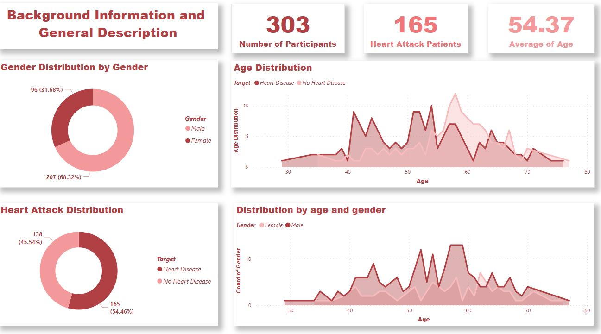
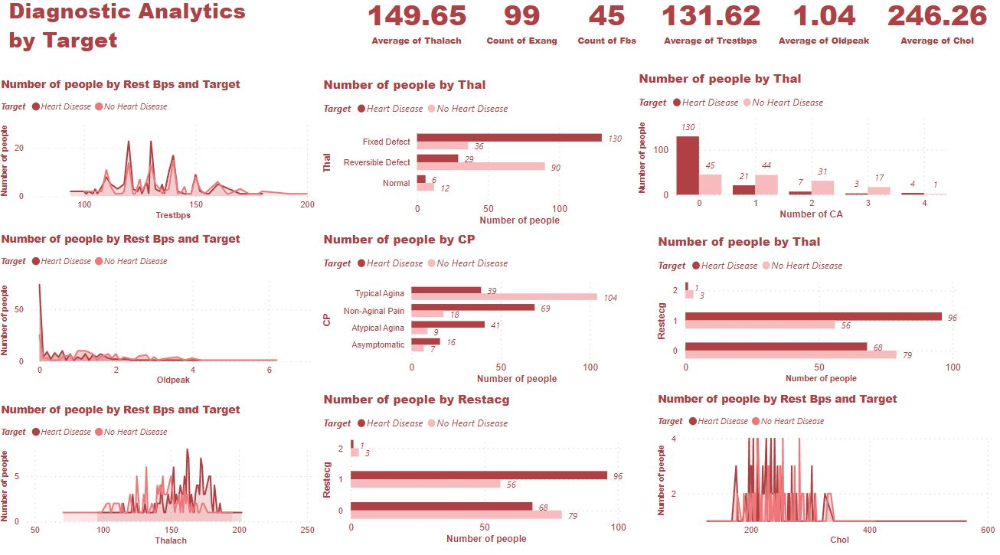
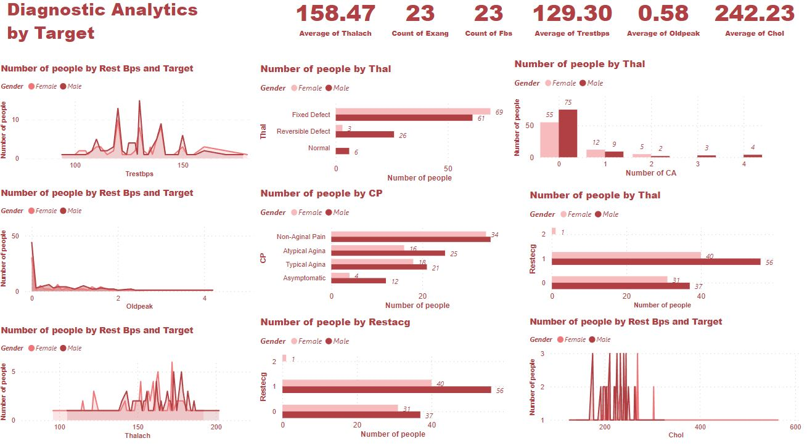

# Data Visualization by Power BI
## Dataset
<!-- TOC -->
- [Cellphone](#cellphone-rating)  
- [Heart Attack Possibility](#heart-attack-possibility)   
<!-- TOC -->

## Cellphone Rating

## Heart Attack Possibility

